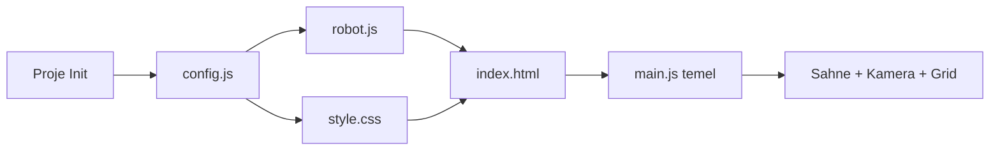
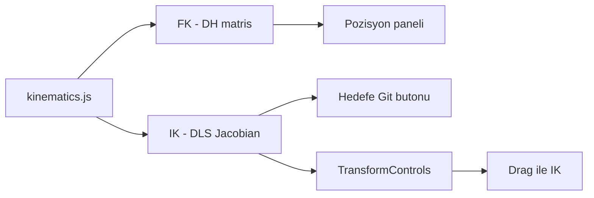
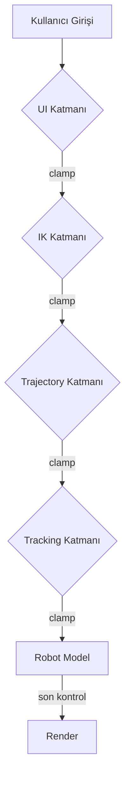

# 6 Eksen Robot Kol Web Simülatörü — Yazılım İmplementasyon Planı

> **SRS v1.0** gereksinimlerine dayalı · Önceki prototipten çıkarılan dersler entegre edilmiştir

---

## 1. Önceki Projeden Çıkarılan Dersler

> [!IMPORTANT]
> Önceki prototipte (Conversation `6ddede0d`) aşağıdaki kritik sorunlar yaşandı ve bu planda çözümleri planlandı:

| # | Sorun | Kök Neden | Bu Plandaki Çözüm |
|---|-------|-----------|-------------------|
| 1 | IK çözücü sahne grafiğinden pozisyon okuyor, stale data | `getEndEffectorPosition()` render olmadan okunuyor | **Bağımsız FK matris zinciri** — sahne grafiğine bağımlı olmayan hesaplama |
| 2 | Eklem dönüş eksenleri sürekli karıştı (X/Y/Z) | Her dosyada ayrı tanım, tutarsızlık | **Merkezi config dosyası** (`config.js`) ile tek noktadan eksen tanımı |
| 3 | Joint limitleri her yerde tekrar tanımlanıyor | HTML, JS, Kinematics ayrı ayrı | **Tek kaynak (Single Source of Truth)** — `config.js`'den tüketim |
| 4 | Robot geometri değişikliğinde 3 dosya güncellenmeli | Sıkı bağlılık (tight coupling) | **DH parametreleri tabanlı** geometri + FK hesaplama |
| 5 | TransformControls angle mapping tutarsızlığı | Manuel eşleme, hata riski | Otomatik eksen algılama config'den |

---

## 2. Teknoloji Kararları

| Katman | Teknoloji | Gerekçe |
|--------|-----------|---------|
| 3D Motor | **Three.js** (latest via npm) | WebGL, geniş topluluk, OrbitControls/TransformControls |
| Build Tool | **Vite** | HMR, hızlı geliştirme |
| UI Framework | **Vanilla JS + CSS** | Hafif, bağımlılık az |
| Matematik | **Özel matris zinciri** | DH parametreleri ile FK, Jacobian IK |
| Proje Yapısı | **ES Modules** | Modüler, test edilebilir |

---

## 3. Proje Dosya Yapısı

```
3dSimulator_AG/
├── index.html              # Ana HTML — layout ve panel yapısı
├── style.css               # Tüm CSS — dark theme, endüstriyel tasarım
├── package.json            # npm bağımlılıkları
├── vite.config.js          # Vite ayarları
│
├── src/
│   ├── main.js             # Giriş noktası — sahne, UI, animasyon döngüsü
│   ├── config.js           # ⭐ TEK KAYNAK — DH, limitler, eksen tanımları, hızlar
│   ├── robot.js            # 3D robot modeli (Three.js mesh hiyerarşisi)
│   ├── kinematics.js       # FK (DH matris) + IK (Jacobian / Gradient Descent)
│   ├── trajectory.js       # Trajectory planning — Joint & Linear interpolasyon
│   ├── tracking.js         # Hedef takibi — closed-loop, stabilite
│   ├── collision.js        # Self-collision + workspace limit (bounding box)
│   ├── scenario.js         # Senaryo yönetimi — kayıt, oynatma, JSON I/O
│   ├── ui.js               # UI güncelleme, slider/input senkronizasyonu
│   └── utils.js            # Yardımcı fonksiyonlar — clamp, deg2rad, matris ops
│
└── assets/                 # (opsiyonel) texture, font vb.
```

---

## 4. Merkezi Konfigürasyon (`config.js`)

> [!TIP]
> Tüm geometri, limit ve eksen bilgisi tek dosyada. Değişiklik yapıldığında sadece burası güncellenir.

```javascript
// config.js — Tek Kaynak (Single Source of Truth)
export const ROBOT_CONFIG = {
  // DH Parametreleri [a, alpha, d, theta_offset]
  dh: [
    { a: 0,   alpha: 0,        d: 35,  offset: 0 },  // J1: Base
    { a: 115, alpha: -Math.PI/2, d: 0,   offset: 0 },  // J2: Omuz
    { a: 115, alpha: 0,        d: 0,   offset: 0 },  // J3: Dirsek
    { a: 0,   alpha: -Math.PI/2, d: 0,   offset: 0 },  // J4: Bilek Roll
    { a: 0,   alpha: Math.PI/2,  d: 0,   offset: 0 },  // J5: Bilek Bend
    { a: 0,   alpha: 0,        d: 15,  offset: 0 },  // J6: Flanş
  ],

  // Eklem limitleri (derece)
  limits: {
    j1: [-130.0, 130.0],
    j2: [-70.0, 130.0],
    j3: [-180.0, 70.0],
    j4: [-270.0, 270.0],
    j5: [-130.0, 130.0],
    j6: [-360.0, 360.0],
  },

  // Dönüş eksenleri (Three.js rotation property)
  axes: ['y', 'z', 'x', 'y', 'x', 'y'],  // R-P-P-R-P-R

  // Hareket türleri
  motionType: ['roll', 'pitch', 'pitch', 'roll', 'pitch', 'roll'],

  // Başlangıç pozisyonları
  homePosition: { j1: 0, j2: -78.51, j3: 73.9, j4: 0, j5: 0, j6: 0 },
  startPosition: { j1: 0, j2: 0, j3: 0, j4: 0, j5: 0, j6: 0 },

  // Hız varsayılanları
  speed: {
    defaultMove: 60,     // 0-100
    defaultAccel: 20,    // kalkış hızı
    defaultDecel: 20,    // duruş hızı
  },

  // Link uzunlukları (mm) — DH'den türetilir ama referans için
  linkLengths: {
    base_to_shoulder: 35,
    shoulder_to_elbow: 115,
    elbow_to_wrist: 115,
  }
};
```

---

## 5. Modül Sorumlulukları

### 5.1 `robot.js` — 3D Model

**Girdi:** `ROBOT_CONFIG` (DH, eksenler, link uzunlukları)  
**Çıktı:** Three.js sahne grafiği, `setAngles()` metodu

| Sorumluluk | Detay |
|------------|-------|
| Hiyerarşik model | Joint → Link → Joint zinciri |
| Görsel detaylar | Metalik yüzey, kasnak, çatal, motor gövdeleri |
| `setAngles(angles)` | Config'deki `axes` dizisinden dönüş ekseni okur |
| `getJointPositions()` | Her eklemin dünya koordinatını döner (collision için) |
| Malzeme | `MeshStandardMaterial` — metalik, roughness ayarlı |

### 5.2 `kinematics.js` — FK & IK

**Girdi:** Eklem açıları veya hedef pozisyon  
**Çıktı:** End-effector pozisyonu veya çözüm açıları

| Fonksiyon | Algoritma | Notlar |
|-----------|-----------|-------|
| `computeFK(angles)` | DH matris zinciri (4×4) | Sahne grafiğinden bağımsız! |
| `solveIK(target, currentAngles)` | Damped Least Squares (DLS) | Jacobian tabanlı |
| `clampAngles(angles)` | Config limitlerinden hard clamp | Tüm katmanlarda kullanılır |
| `isReachable(target)` | Workspace radius check | Hızlı ön kontrol |

> [!WARNING]
> IK çözücü **asla** `robot.getEndEffectorPosition()` gibi sahne tabanlı bir fonksiyon çağırmamalı. Sadece `computeFK()` kullanmalı.

### 5.3 `trajectory.js` — Yörünge Planlama

| Mod | Açıklama |
|-----|----------|
| Joint interpolation | Her eklem bağımsız interpolasyon (bezier/trapez profil) |
| Linear (Cartesian) | TCP düz çizgi izler, her adımda IK çağrılır |
| Hız profili | Trapez profil: kalkış → hareket → duruş |

```
Parametreler:
- moveSpeed: 0-100 (default 60)
- accelSpeed: 0-100 (default 20)  → kalkış
- decelSpeed: 0-100 (default 20)  → duruş
- stepResolution: ms cinsinden adım aralığı
```

Her adımda limit kontrolü zorunlu.

### 5.4 `tracking.js` — Hedef Takibi

| Mod | Açıklama |
|-----|----------|
| Position tracking | Sadece XYZ |
| Full pose tracking | XYZ + orientation |
| Look-at mode | Uç işlevci hedefe "bakar" |

**Stabilite kuralları:**
- Düşük geçişli filtre (low-pass) — overshoot/oscillation önleme
- Hata eşiği (dead zone) — ani sıçrama önleme
- Hız sınırlama — maksimum açısal hız/frame

### 5.5 `collision.js` — Çarpışma Kontrolü

| Kontrol | Yöntem |
|---------|--------|
| Self-collision | Bounding sphere/box per link, pairwise distance |
| Workspace limit | Küresel/silindirik sınır |

### 5.6 `scenario.js` — Senaryo Yönetimi

```json
// Senaryo formatı
{
  "name": "Test Senaryosu 1",
  "created": "2026-04-29T21:00:00",
  "steps": [
    {
      "type": "joint",        // veya "linear"
      "target": { "j1": 45, "j2": -30, ... },
      "moveSpeed": 60,
      "accelSpeed": 20,
      "decelSpeed": 20
    }
  ]
}
```

- JSON export/import
- Play / Pause / Stop
- Timeline scrubbing

### 5.7 `ui.js` — Arayüz Yönetimi

| Alan | İçerik |
|------|--------|
| Sağ panel | Joint kontroller (slider + numeric), pozisyon bilgisi |
| Alt panel | Timeline, senaryo kontrolleri |
| Orta | 3D viewport |
| Çıktı paneli | Tüm eklemlerin anlık açı değerleri + ilgili step için kalkış hızı, hareket hızı, duruş hızı — dizi formatında kopyalanabilir |
| Uyarılar | Limit yaklaşma renk uyarısı, unreachable pose hatası |

---

## 6. Geliştirme Fazları

### Faz 1: Temel Altyapı (Gün 1-2)



**Görevler:**

- [ ] **1.1** Proje başlatma: `npm init`, Three.js + Vite kurulumu
- [ ] **1.2** `config.js` — DH parametreleri, limitler, eksenler, home/start pozisyonları
- [ ] **1.3** `index.html` — 3 panelli layout (sol: kontrol, orta: viewport, sağ: bilgi, alt: timeline)
- [ ] **1.4** `style.css` — Dark theme, endüstriyel tasarım, metalik aksan renkleri
- [ ] **1.5** `robot.js` — ABB IRB 120 benzeri 3D model (R-P-P-R-P-R konfigürasyonu)
  - Kasnak/dişli detayları, çatal yapıları, motor gövdeleri
  - `setAngles()` — config'den eksen okuyan
- [ ] **1.6** `main.js` — Sahne kurulumu, OrbitControls, grid, XYZ eksenleri, ışık/gölge
- [ ] **1.7** `ui.js` — Slider ↔ 3D senkronizasyonu, limit enforcing (hard clamp)
- [ ] **1.8** Home pozisyonunda başlatma (J2=-78.51, J3=73.9)

**Çıktı:** Robot görsel olarak render ediliyor, slider'larla kontrol edilebiliyor.

---

### Faz 2: Kinematik & Kontrol (Gün 3-4)



**Görevler:**

- [ ] **2.1** `kinematics.js` — Forward Kinematics (DH matris zinciri, sahne bağımsız)
- [ ] **2.2** `kinematics.js` — Inverse Kinematics (Damped Least Squares)
  - Limit dışı çözümler elenir
  - Çözüm yoksa "Unreachable pose" hatası
  - Birden fazla çözüm desteği (en yakın seçim)
- [ ] **2.3** End-effector pozisyon/orientation gösterimi (XYZ + RPY)
- [ ] **2.4** TransformControls ile hedef sürükleme → real-time IK
- [ ] **2.5** "Hedefe Git (IK)" butonu
- [ ] **2.6** "Home Pozisyonuna Git" ve "Start Pozisyonuna Git" butonları
- [ ] **2.7** Limit kontrolü: UI + IK + tüm katmanlarda

**Çıktı:** FK/IK çalışıyor, hedef sürüklenebiliyor, robot takip ediyor.

---

### Faz 3: Gelişmiş Özellikler (Gün 5-7)

**Görevler:**

- [ ] **3.1** `trajectory.js` — Joint interpolation (trapez hız profili)
- [ ] **3.2** `trajectory.js` — Linear (Cartesian) interpolation
- [ ] **3.3** Hız parametreleri: kalkış(20), hareket(60), duruş(20) — ayarlanabilir
- [ ] **3.4** `tracking.js` — Position tracking (closed-loop)
- [ ] **3.5** `tracking.js` — Full pose tracking & Look-at mode
- [ ] **3.6** Stabilite: düşük geçişli filtre, dead zone, hız sınırlama
- [ ] **3.7** `collision.js` — Self-collision (bounding box)
- [ ] **3.8** `collision.js` — Workspace limit
- [ ] **3.9** `scenario.js` — Hareket dizisi oluşturma
- [ ] **3.10** `scenario.js` — JSON kaydetme/yükleme
- [ ] **3.11** `scenario.js` — Tekrar oynatma (Play/Pause/Stop)
- [ ] **3.12** Timeline UI — alt panel, scrubbing
- [ ] **3.13** Animasyon: 60 FPS hedef, akıcı hareket
- [ ] **3.14** Çıktı paneli — anlık eklem açıları dizi formatında

**Çıktı:** Trajectory, tracking, senaryo sistemi çalışıyor.

---

### Faz 4: Polish & Test (Gün 8-9)

**Görevler:**

- [ ] **4.1** Görsel kalite: metalik yüzey, soft shadow, endüstriyel ışıklama
- [ ] **4.2** Limit yaklaşma renk uyarısı (slider + 3D model)
- [ ] **4.3** Responsive layout optimizasyonu
- [ ] **4.4** Performans: 60 FPS doğrulama, GPU profiling
- [ ] **4.5** Boundary test: tüm limit değerleri doğru çalışmalı
- [ ] **4.6** IK test: erişilebilir/erişilemez hedefler
- [ ] **4.7** Tracking test: hareketli hedef stabil takip
- [ ] **4.8** Tarayıcı uyumluluk: Chrome + Edge
- [ ] **4.9** SEO: title, meta, semantic HTML

**Çıktı:** Prodüksiyona hazır, test edilmiş simülatör.

---

## 7. UI Layout Detayı

```
┌──────────────────────────────────────────────────────────────┐
│  🤖 6-Axis Robot Arm Simulator        [Home] [Start] [Auto] │
├────────────┬─────────────────────────────┬───────────────────┤
│            │                             │  JOINT KONTROL    │
│  HEDEF     │                             │  J1 ═══○═══ 0.0° │
│  (TCP)     │                             │  J2 ═══○═══ -78° │
│  X: ___    │        3D VIEWPORT          │  J3 ═══○═══ 73°  │
│  Y: ___    │                             │  J4 ═══○═══ 0.0° │
│  Z: ___    │     (WebGL + OrbitCtrl)     │  J5 ═══○═══ 0.0° │
│            │                             │  J6 ═══○═══ 0.0° │
│  TRACKING  │                             │─────────────────── │
│  ○ Pos     │                             │  POZİSYON BİLGİSİ│
│  ○ Pose    │                             │  X:  Y:  Z:       │
│  ○ Look-at │                             │  Rx: Ry: Rz:      │
│            │                             │                   │
│  HIZ       │                             │  ÇIKTI PANELİ     │
│  Hareket:60│                             │  [0, -78, 73, ...] │
│  Kalkış:20 │                             │                   │
│  Duruş: 20 │                             │                   │
├────────────┴─────────────────────────────┴───────────────────┤
│  TIMELINE  ▶ ❚❚ ■  ═══════════●══════════════  00:03/00:10  │
│  SENARYO   [+ Adım] [Kaydet JSON] [Yükle] [Oynat] [Durdur]  │
└──────────────────────────────────────────────────────────────┘
```

---

## 8. Kritik Teknik Kararlar

### 8.1 FK Hesaplama — DH Matris Zinciri

```
T_i = Rz(θi) · Tz(di) · Tx(ai) · Rx(αi)

T_total = T1 · T2 · T3 · T4 · T5 · T6
```

- Sahne grafiğinden **tamamen bağımsız**
- Her IK iterasyonunda çağrılabilir (performans kritik)

### 8.2 IK Çözücü — Damped Least Squares

```
Δθ = Jᵀ(JJᵀ + λ²I)⁻¹ · e

λ = damping factor (adaptif)
e = hedef - mevcut pozisyon hatası
```

- Singularity-robust
- Her iterasyonda limit clamp
- Maksimum 200 iterasyon, hata eşiği < 0.1mm

### 8.3 Trajectory Hız Profili

```
       ▲ hız
  max  │    ┌─────────┐
       │   /│         │\
       │  / │         │ \
       │ /  │         │  \
  0    │/   │         │   \
       └────┴─────────┴────► zaman
        acc   cruise   dec
```

### 8.4 Limit Yönetimi Katmanları



Her katmanda `clampAngles()` çağrılır — defense in depth.

---

## 9. Başarı Kriterleri Eşleme

| SRS Kriteri | İmplementasyon | Faz |
|-------------|----------------|-----|
| Robot hedef pozisyona doğru ulaşmalı | IK + FK doğrulama | 2 |
| Hareketler akıcı olmalı | 60 FPS + interpolasyon | 3, 4 |
| Limit ihlali olmamalı | 4 katmanlı clamp | 1-4 |
| Tracking stabil çalışmalı | Low-pass filtre + dead zone | 3 |
| Home pozisyonu doğru | Config'den başlatma | 1 |
| Start pozisyonu doğru | Config'den geçiş | 2 |

---

## 10. Risk ve Azaltma

| Risk | Olasılık | Etki | Azaltma |
|------|----------|------|---------|
| IK çözücü sahne bağımlılığı | Yüksek (önceden yaşandı) | Kritik | Bağımsız FK matris zinciri |
| Eksen karışıklığı | Yüksek (önceden yaşandı) | Kritik | Merkezi config, tek kaynak |
| Performans düşüşü | Orta | Yüksek | Profiling, optimize IK |
| Singularity sorunları | Orta | Orta | DLS damping |
| Tarayıcı uyumsuzluk | Düşük | Düşük | Chrome/Edge hedef |

---

> [!NOTE]
> Bu plan onaylandıktan sonra **Faz 1**'den başlayarak implementasyona geçilecektir. Her faz sonunda tarayıcı doğrulaması yapılacaktır.
